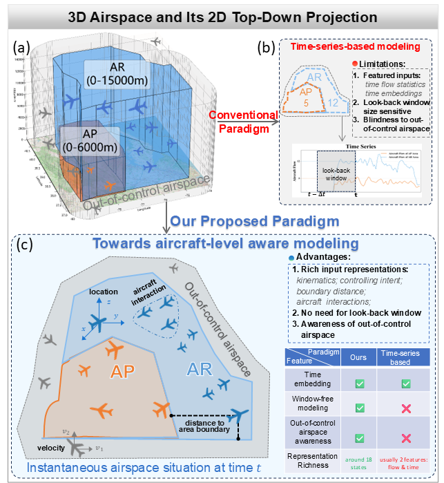
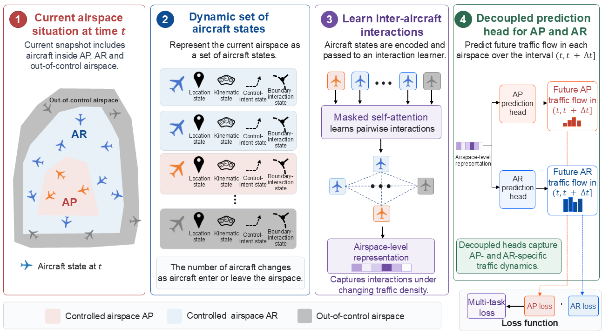

# AeroSense

### Unlocking air traffic flow prediction through microscopic aircraft-state modeling

Official PyTorch implementation of **AeroSense**, an aircraft-level **state-to-flow** framework for short-term air traffic flow prediction.

[Paper](https://arxiv.org/abs/2605.10083) | [Code](https://github.com/aspjy/aerosense_open)

---

## 1. Introduction

Most existing air traffic flow forecasting methods formulate the task as **history-to-flow prediction**, where aircraft trajectories are first aggregated into macroscopic traffic-flow sequences and future traffic is inferred from a historical look-back window.

**AeroSense explores an alternative state-to-flow formulation.** At each query time \(t\), AeroSense represents the instantaneous airspace situation as a variable-cardinality set of individual aircraft states and directly predicts future regional traffic demand over \((t,t+\Delta t]\).

This study focuses on **15-minute-ahead forecasting** for two terminal-airspace regions: the **Approach Airspace (AP)** and the **Airspace Control Region (AR)**.

### Selected Results

AeroSense is compared with representative time-series forecasting methods under the same chronological evaluation protocol. Selected results from the full comparison are shown below.

**Approach Airspace (AP)**

| Model         |             MAE ↓ |            RMSE ↓ |              WAPE ↓ |                R² ↑ |
| ------------- | ----------------: | ----------------: | ------------------: | ------------------: |
| Autoformer    |     2.066 ± 0.043 |     2.646 ± 0.055 |     14.836 ± 0.308% |     0.9003 ± 0.0042 |
| TimesNet      |     1.551 ± 0.013 |     2.046 ± 0.014 |     11.133 ± 0.095% |     0.9404 ± 0.0008 |
| GTR           |     1.523 ± 0.005 |     2.024 ± 0.008 |     10.932 ± 0.039% | **0.9417 ± 0.0005** |
| **AeroSense** | **1.308 ± 0.018** | **1.800 ± 0.029** | **10.930 ± 0.148%** |     0.9415 ± 0.0019 |

**Airspace Control Region (AR)**

| Model         |             MAE ↓ |            RMSE ↓ |             WAPE ↓ |                R² ↑ |
| ------------- | ----------------: | ----------------: | -----------------: | ------------------: |
| Autoformer    |     4.280 ± 0.152 |     5.486 ± 0.182 |    11.114 ± 0.394% |     0.9451 ± 0.0037 |
| TimesNet      |     2.783 ± 0.032 |     3.634 ± 0.035 |     7.227 ± 0.083% |     0.9759 ± 0.0005 |
| GTR           |     2.675 ± 0.013 |     3.559 ± 0.008 |     6.947 ± 0.034% |     0.9769 ± 0.0001 |
| **AeroSense** | **1.445 ± 0.021** | **1.942 ± 0.029** | **4.293 ± 0.063%** | **0.9910 ± 0.0003** |


> Results are reported as mean ± standard deviation over five random seeds.  
> See the paper for the complete comparison with naive, augmented time-series, ATM-specific, and set-based baselines.

---

The operational dataset is derived from surveillance records provided by a local ATC authority, where **SSR and ADS-B measurements are fused into unified aircraft trajectories** at a 4-second temporal resolution.

### Operational Trajectory Example

Each aircraft trajectory consists of consecutive surveillance records.  
The table below shows selected fields from one anonymized trajectory record sequence:

| timestamp | arcid       | latitude | longitude | height | speed | vertical speed | heading | dial speed | dial height |
| --------- | ----------- | -------: | --------: | -----: | ----: | -------------: | ------: | ---------: | ----------: |
| xx:xx:00  | Aircraft_xx |    xx.xx |     xx.xx |     xx |    xx |             xx |      xx |         xx |          xx |
| xx:xx:04  | Aircraft_xx |    xx.xx |     xx.xx |     xx |    xx |             xx |      xx |         xx |          xx |
| xx:xx:08  | Aircraft_xx |    xx.xx |     xx.xx |     xx |    xx |             xx |      xx |         xx |          xx |

The basic **4-D trajectory** is formed by:

**time · longitude · latitude · altitude**

and is accompanied by aircraft kinematic and control-related states such as speed, vertical speed, heading, dialed speed, and dialed altitude.

At each query time, AeroSense extracts the current states of all observed aircraft and constructs the dynamic aircraft set used for state-to-flow prediction.

## 2. Motivation

Conventional air traffic flow forecasting typically aggregates aircraft trajectories
into macroscopic traffic-flow sequences and predicts future demand from a fixed-length
historical look-back window. This representation is convenient, but may discard
fine-grained aircraft-level information such as kinematics, boundary proximity,
and surrounding traffic context.

From an online forecasting perspective, time-series models also require the historical
flow buffer to be continuously aggregated, maintained, and synchronized before each
prediction. Missing or delayed observations may require the corresponding input
sequence to be repaired or reconstructed.

**AeroSense takes a different approach:** it predicts directly from the latest
aircraft-state set \(S_t\), allowing each forecast to be generated from the current
airspace situation without requiring a preceding historical flow window.

<p align="center">
  
</p>


<p align="center">
  <em>
  Motivation of the proposed aircraft-level state-to-flow formulation.
  </em>
</p>


---

## 3. Key Idea

AeroSense directly **maps the instantaneous microscopic state of the airspace to future macroscopic traffic demand**.

<p align="center">
  
</p>


Compared with conventional aggregated time-series forecasting, AeroSense:

- directly models aircraft-level states instead of pre-aggregated flow sequences;
- naturally handles variable-cardinality traffic situations without requiring a historical look-back window;
- supports real-time prediction from the current surveillance snapshot while preserving aircraft-level dynamics and interactions.

---

## 4. Aircraft-State Representation

Each aircraft is represented by an 18-dimensional state vector comprising five groups of information:

**Location state** *(latitude, longitude, altitude)* ·  
**Kinematic state** *(ground speed, vertical speed, heading)* ·  
**Partial control-intent cues** *(dialed speed, dialed altitude)* ·  
**Boundary-interaction state** *(AP/AR boundary distance, approach factor, airspace inclusion indicators)* ·  
**Temporal context** *(cyclical hour and minute embeddings)*

---

## 5. Model

AeroSense contains four main components:

1. **Shared aircraft encoder**  
   Each aircraft state is projected into a latent representation by a shared MLP.

2. **Masked self-attention**  
   Inter-aircraft dependencies are modeled while excluding padded aircraft states from attention.

3. **SumPooling**  
   Valid aircraft representations are aggregated into an airspace-level representation while preserving traffic-scale information.

4. **Decoupled AP/AR prediction heads**  
   Two independent prediction branches estimate future traffic demand in AP and AR.

During mini-batch training, variable-cardinality aircraft sets are dynamically padded to the largest set size in the current batch.

---

##  6. Repository Structure

```text
aerosense_open/
├── dataloader.py
├── model.py
├── module.py
├── train.py
├── test.py
├── utils.py
├── requirements.txt
├── LICENSE
│
├── optDir/
│   └── opt.json
│
├── data/
│   ├── aerosense_demo_500.pkl
│   └── README.md
│
├── examples/
│   └── make_toy_data.py
│
└── tools/
    └── export_processed_data.py
```

---

##  7. Getting Started

### 7.1 Installation

```bash
git clone https://github.com/aspjy/aerosense_open.git
cd aerosense_open

pip install -r requirements.txt
```

### 7.2 Training

```bash
python train.py --opt optDir/opt.json
```

### 7.3 Evaluation

```bash
python test.py \
    --opt optDir/opt.json \
    --checkpoint checkpoints/best_model.pt
```

Outputs are written to the `checkpoints/` directory.

---

##  8. Demo Data

A small processed example dataset is included:

```text
data/aerosense_demo_500.pkl
```

The file contains **500 processed samples** and is provided only for verifying the end-to-end code pipeline.

It is **not** the full operational dataset used to produce the experimental results reported in the paper.

The processed data format is:

```python
{
    "X": [x_0, x_1, ..., x_n],
    "y": y,
    "timestamps": timestamps,
    "feature_names": feature_names,
    "metadata": metadata
}
```

where

```text
x_i.shape = [number_of_aircraft_at_time_i, 18]
y.shape   = [number_of_samples, 2]
```

and

```text
y[:, 0] = AP target
y[:, 1] = AR target
```

For each target airspace, an aircraft contributes once if it appears in that region at any time within the future prediction interval.

---

##  9. Experimental Setting

The default configuration in `optDir/opt.json` is a lightweight setting for running the released demo.

The full-scale experiments reported in the paper use the experimental protocol described in the manuscript, including:

```text
Hidden dimension        128
Attention heads         4
Dropout                 0.1
Batch size              32
Optimizer               Adam
Initial learning rate   3e-4
Weight decay            1e-5
Maximum epochs          100
Loss                    Huber loss
Gradient clipping       1.0
```

All learning-based experiments in the revised study are evaluated over multiple random seeds.

---

##  10. Experiments in the Paper

The manuscript evaluates AeroSense against several groups of baselines:

- naive forecasting;
- conventional time-series forecasting;
- augmented time-series forecasting;
- recent ATM-specific forecasting methods;
- set-based neural models.

Additional analyses include model-component ablation, aircraft-state ablation, pooling-strategy analysis, month-wise testing, robustness tests, surrounding-airspace scope sensitivity, and online evaluation on unseen 2026 operational data.

---

##  11. Data Availability

The full operational surveillance dataset contains ATC-related information and is not included in this public repository.

The released demo subset is intended for code verification and format demonstration. Please refer to the manuscript for the data-availability statement associated with the full study.

---

##  12. Citation

If you find this repository useful, please cite:

```bibtex
@misc{wang2026aerosense,
  title        = {Unlocking air traffic flow prediction through microscopic aircraft-state modeling},
  author       = {Wang, Bin and Liu, Anqi and Zhao, Jiangtao and Huang, Yanyong
                  and Birahmani, Hina and He, Peilan and Jiang, Guiyuan
                  and Hong, Feng and Yu, Yanwei and Hou, Yuanyuan and Li, Tianrui},
  year         = {2026},
  eprint       = {2605.10083},
  archivePrefix= {arXiv},
  primaryClass = {cs.LG},
  doi          = {10.48550/arXiv.2605.10083}
}
```

---

## 13. License

This project is released under the [Apache License 2.0](LICENSE).

---

## 14. Contact

For questions related to the paper or implementation, please contact the corresponding authors through the information provided in the manuscript.
