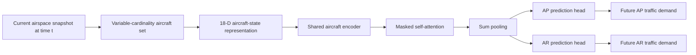

<div align="center">

# AeroSense

### Unlocking air traffic flow prediction through microscopic aircraft-state modeling

**A state-to-flow framework for short-term terminal-airspace traffic forecasting from instantaneous aircraft states**

[](https://www.python.org/)
[](https://pytorch.org/)
[](LICENSE)
[](https://arxiv.org/abs/2605.10083)

</div>

## Overview

Conventional short-term air traffic flow forecasting is commonly formulated as a **history-to-flow** problem: aircraft trajectories are first aggregated into macroscopic traffic-flow sequences, and future demand is predicted from a historical look-back window.

**AeroSense reformulates this task as state-to-flow prediction.** At a query time `t`, the current airspace is represented directly as a variable-cardinality set of aircraft states. AeroSense maps this instantaneous microscopic airspace situation to the future traffic demand in the **Approach Airspace (AP)** and **Airspace Control Region (AR)** over `(t, t + Δt]`.

The study focuses on **15-minute-ahead forecasting** and uses aircraft-level surveillance trajectories; the operational dataset used in the paper is constructed from fused **SSR and ADS-B** records provided by a local ATC authority. The formulation is intended as a surveillance-based forecasting component that can complement, rather than replace, flight-plan and other operational information. fileciteturn7file0

## From history-to-flow to state-to-flow



Each aircraft is represented using five groups of states:

- **Location:** latitude, longitude, altitude
- **Kinematics:** ground speed, vertical speed, heading
- **Partial control-intent cues:** dialed airspeed and dialed altitude
- **Boundary interactions:** AP/AR boundary distance, approach factors, and inclusion indicators
- **Temporal context:** cyclical hour and minute embeddings

The model uses masked self-attention to capture dependencies among valid aircraft, **SumPooling** to preserve traffic-scale information, and decoupled AP/AR heads to model the two target regions separately.

## Repository contents

```text
AeroSense
├── dataloader.py              # Variable-cardinality data loading and dynamic padding
├── model.py                   # AeroSense model
├── module.py                  # Shared MLP, masked attention, pooling, prediction heads
├── train.py                   # Training and validation
├── test.py                    # Evaluation
├── utils.py                   # Metrics, logging, JSON utilities, seed control
├── requirements.txt
├── LICENSE
├── optDir/
│   └── opt.json               # Lightweight demo configuration
├── data/
│   ├── aerosense_demo_500.pkl # Processed 500-sample demo subset
│   └── README.md              # Processed-data format
├── examples/
│   └── make_toy_data.py       # Synthetic demo-data generator
└── tools/
    └── export_processed_data.py
```

## Quick start

### 1. Install dependencies

```bash
git clone https://github.com/aspjy/aerosense_open.git
cd aerosense_open
pip install -r requirements.txt
```

### 2. Train on the included demo subset

```bash
python train.py --opt optDir/opt.json
```

### 3. Evaluate the saved checkpoint

```bash
python test.py --opt optDir/opt.json --checkpoint checkpoints/best_model.pt
```

Training outputs are written to `checkpoints/`, including the best model checkpoint and training log. Evaluation writes the corresponding metrics and predictions.

> **Note on reproducibility.** The bundled `data/aerosense_demo_500.pkl` and `optDir/opt.json` are provided to verify the end-to-end code pipeline. They are **not** the full operational dataset or the exact large-scale experimental setting used to produce the paper results. The manuscript experiments use the full chronological dataset and the experimental configuration reported in the paper.

## Processed data format

Each sample contains a variable number of aircraft:

```python
{
    "X": [array_1, array_2, ...],  # array_i: [num_aircraft_i, 18]
    "y": np.ndarray,              # [num_samples, 2], order: [AP, AR]
    "timestamps": [...],          # optional
    "feature_names": [...],       # recommended
    "metadata": {...}             # optional
}
```

The default 18-dimensional feature order is:

```text
 0  latitude
 1  longitude
 2  height
 3  speed
 4  climbOrDescendSpeed
 5  direction
 6  dialSpeed
 7  dialHeight
 8  dist2area_AP
 9  dist2area_AR
10  approach_factor_AP
11  approach_factor_AR
12  is_in_AP
13  is_in_AR
14  hour_sin
15  hour_cos
16  minute_sin
17  minute_cos
```

The target order is:

```text
y[:, 0] = future AP traffic demand
y[:, 1] = future AR traffic demand
```

For each target region, an aircraft contributes once if it appears in that region at any time within the prediction interval `(t, t + Δt]`.

## Paper results

On the chronologically held-out test set reported in the manuscript, AeroSense achieves:

| Airspace | MAE | RMSE | WAPE | R² |
|---|---:|---:|---:|---:|
| AP | **1.308 ± 0.018** | **1.800 ± 0.029** | **10.930 ± 0.148%** | 0.9415 ± 0.0019 |
| AR | **1.445 ± 0.021** | **1.942 ± 0.029** | **4.293 ± 0.063%** | **0.9910 ± 0.0003** |

The revised evaluation includes naive forecasting, recent general-purpose time-series models, augmented time-series models, ATM-specific forecasting methods, and set-based baselines, together with ablation, robustness, surveillance-scope, month-wise, and online operational analyses. fileciteturn7file0

## Demo configuration vs. paper configuration

The default repository configuration is intentionally lightweight for quick execution. Key paper settings reported in the manuscript include a 128-dimensional aircraft encoder, 4-head self-attention, batch size 32, Adam with learning rate `3e-4`, Huber loss, and up to 100 training epochs with validation-based early stopping. Please refer to the manuscript for the complete experimental protocol. fileciteturn7file0

## Citation

If you find AeroSense useful in your research, please cite:

```bibtex
@misc{wang2026aerosense,
  title        = {Unlocking air traffic flow prediction through microscopic aircraft-state modeling},
  author       = {Wang, Bin and Liu, Anqi and Zhao, Jiangtao and Huang, Yanyong and Birahmani, Hina and He, Peilan and Jiang, Guiyuan and Hong, Feng and Yu, Yanwei and Hou, Yuanyuan and Li, Tianrui},
  year         = {2026},
  eprint       = {2605.10083},
  archivePrefix= {arXiv},
  primaryClass = {cs.LG},
  doi          = {10.48550/arXiv.2605.10083},
  url          = {https://arxiv.org/abs/2605.10083}
}
```

## License

This project is released under the [Apache License 2.0](LICENSE).
